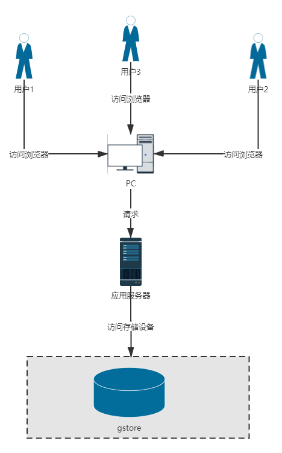
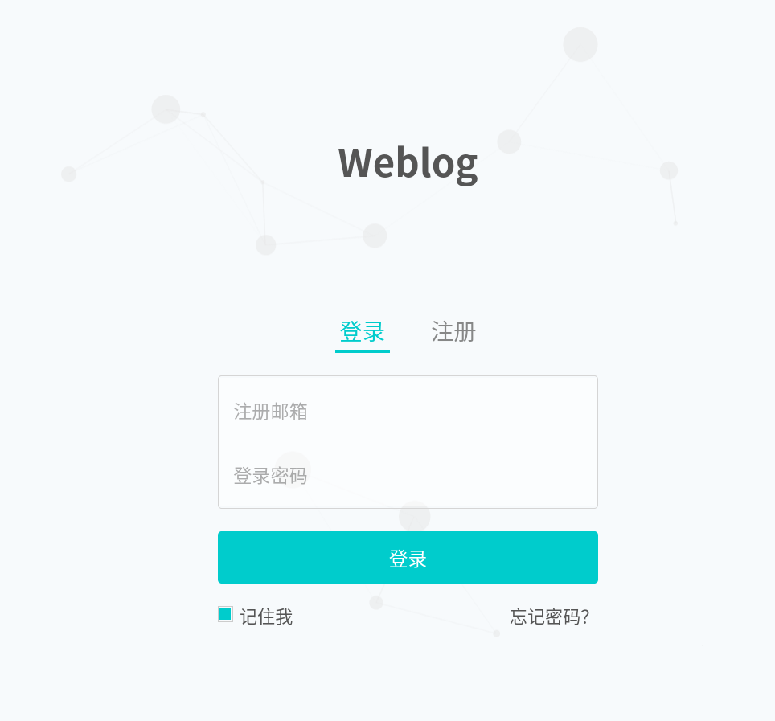
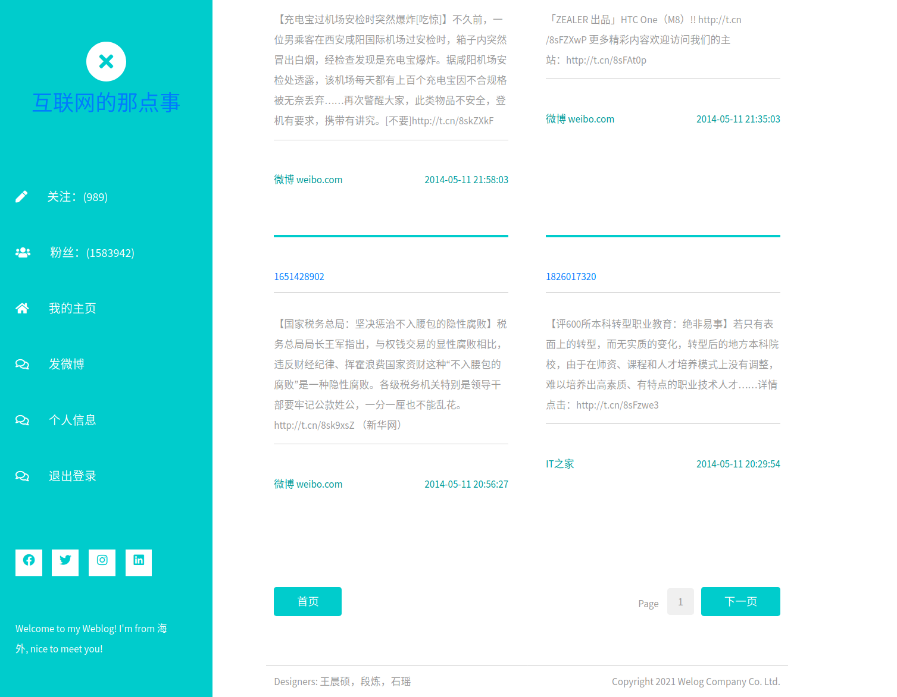
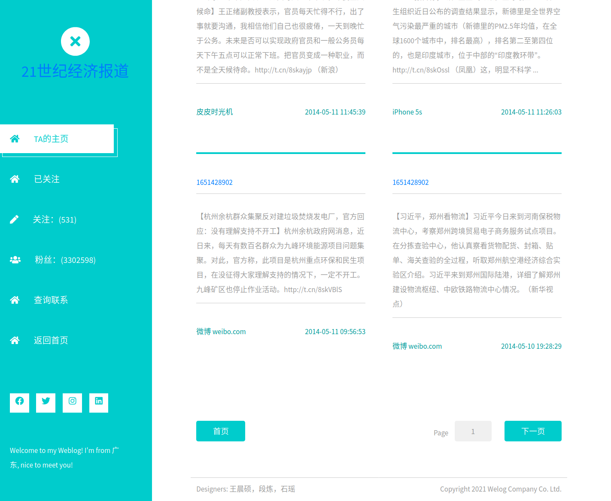
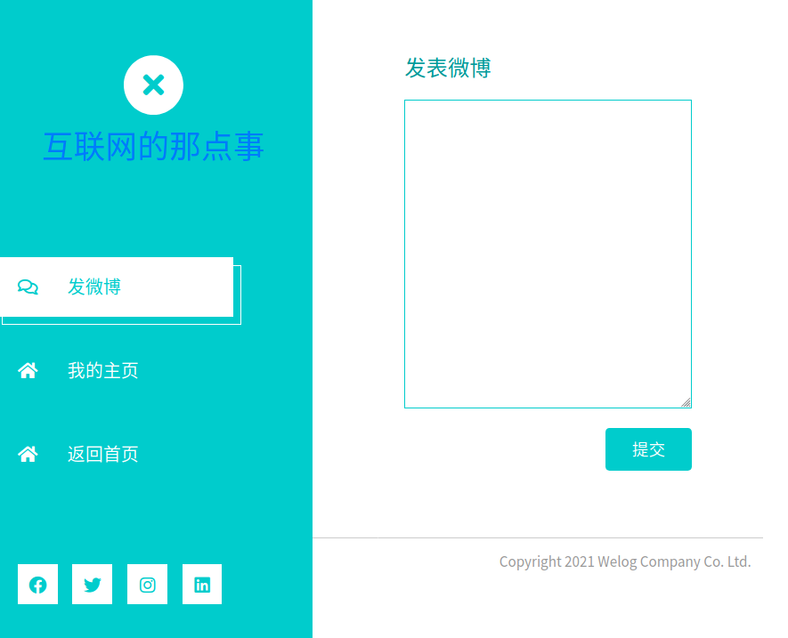
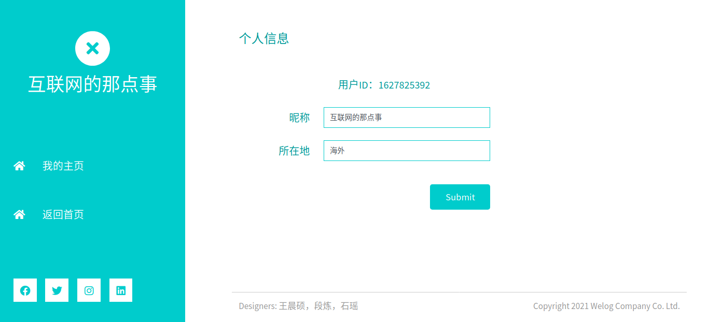
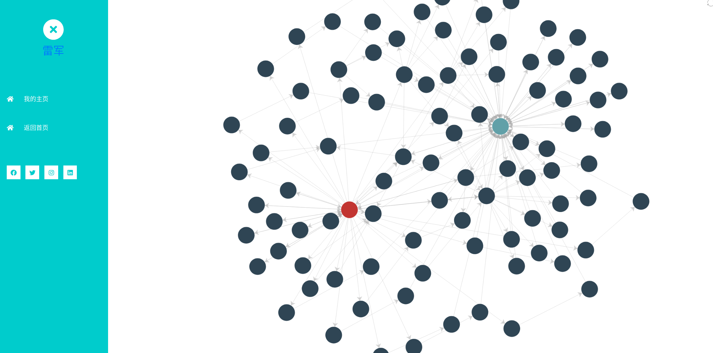

## 1.设计方案

### 1.1 技术选型

本项目Web框架选择为Flask，后端开发语言为Python，前端使用HTML+CSS+JavaScript实现，数据库使用图数据库系统gstore，在本地完成部署后可直接通过浏览器访问。


### 1.2 概念模型


#TODO


## 2.系统架构



由于项目未部署上线，所以所有内容都在本地。首先需要开启gstore服务，然后运行基于Flask的server，便可以在本地浏览器访问页面并通过HTTP请求服务。


## 3 关键代码

后端和数据库的操作集中在四个文件中，每个文件的大概用途如下图所示：

```
.
├── main.py -- back end functions
├── processdata.py -- convert weibodatabase.sql to data.nt
├── utils_gstore.py -- functions for basic manipulations in gStore
└── utils_weibo.py -- functions for back end
```

### 3.1 `processdata.py`

功能：将老师提供的 weibodatabase.sql 转换为 gStore 可以识别的 data.nt。

为了后续的优化和使用的方便，我们并没有使用网上现成的代码进行转换，而是手动转换。手动转换的好处有三：

1. 我们舍弃掉了不需要展示的数据，比如用户的性别、用户重复的昵称、用户创建的时间等等，这样能大大加快查询速度。

2. 我们手动转换的代码是将 sql 语句转化为形如 `<><><>` 的三元组的形式，这样得到的 data.nt 文件只有 100 多 M，节省存储空间；生成 data.nt 的过程只要一瞬间，不浪费生命。

3. 【重点】只有手动转换，才能在转换数据库的时候，就在数据库中增添用户的初始密码、用户的默认邮箱等信息，否则就要在建好数据库后，一条条插入到数据库中，浪费生命。

在转换的过程中，还解决了一些问题、做了一些改进改进：

1. 由于我们是转化为形如 `<><><>` 的三元组的形式，因此微博文本中若有单书名号或者空格，则会对整个三元组造成影响。因此，我们在转换时，将 `<` `>` 和空格转换为特殊字符；当查询数据库时，再将这三种特殊字符换回。尽管方法不够优雅，但确实使用最少的成本实现了完整的功能。

2. 切分 sql 语句时，朴素的想法是使用 `sentence.split("\', \'")` 将一句话中的各种信息进行切分，但是在微博文本中也可能出现 `', '` 这样的 pattern，造成多切。我们增加了 `mergeandmove(lst)` 函数，对这种特殊情况进行合并：

    ```py
    def mergeandmove(lst):
        '''
        input: a list [1,2,3,4...]
        output: a list [12, ,3,4...]
        '''
        res = [lst[0] + ", " + lst[1]]
        for i in lst[2:]:
            res.append(i)
        return res
    ```

3. 为了可以让数据库中的用户登录，我们在转换数据时，就直接在文件中加入了用户的邮箱和密码，邮箱默认为 uid@gstore.com，密码默认为 gstore

4. 由于没有做转发等功能，我们直接舍弃了 weiborelation 部分的数据

### 3.2 `utils_gstore.py`

功能：提供最基本的四类查询接口，分别是查询三元组、插入三元组、删除三元组、多条查询。

#### 3.2.1 查询三元组

输入一个残缺的三元组（即有一个位置为空），返回空的位置，或整个三元组。函数的定义如下：

```py
def query(gc, triplet, return_type = 'node'):
    '''
    give 2 of 3, return the left one
    input: 
        gc: GstoreConnector
        triplet: a triplet list, 3 position in which is 'head entity, relation, tail entity', there must contains 2 items(any 2 is valid), othervise invalid
        return_type: 
            node: return matched modes
            triplet: return matched triplets
    output: result a list of lists, which are triplets queried from graph
    '''
```

函数的原理比较简单，就是利用输入的参数写出 sql 语句，使用 gStore python API 进行查询。

#### 3.2.2 插入和删除三元组

原理也比较简单，利用输入的参数写出 `INSERT DATA` 和 `DELETE DATA` 语句，对数据库进行操作。注意，在删除之前，先要查询数据库中是否存在这个三元组。

#### 3.2.4 多跳查询

原理也比较简单，例如，查询两个用户之间四跳的关系路径时，凑出如下的 sql 语句：

```sql
SELECT *
WHERE {
    <uid/%s> <userrelation> ?e1 . 
    ?e1 <userrelation> ?e2 . 
    ?e2 <userrelation> ?e3 . 
    ?e3 <userrelation> <uid/%s> . 
    }
```

最后将查询得到的结果整理，返回方便前端展示的数据。

### 3.3 `utils_weibo.py`

功能：用户的具体操作中的每个动作环节均对应一个函数，函数的大概描述如下：

1. `_login(gc, email, pwd)` 使用邮箱和密码登录，若正确匹配，则返回“登陆成功”和 uid；否则返回“登录失败”

2. `_register(gc, email, username, pwd)` 使用邮箱、密码、用户名注册

3. `_userinfo(gc, uid)` 查询指定用户的全部个人信息，返回其昵称、粉丝数、关注数、地点

4. `_changeinfo(gc, uid, newloc)` 修改指定用户的地址信息

5. `_userfollowing(gc, uid)` 查询指定用户的关注列表，返回 uid 的列表

6. `myfollowings(gc, uid)` 查询指定用户的关注列表，调用了 5，返回关注的人的具体信息，包括 uid、昵称、关注者数量、粉丝数、地址的信息

7. `_userweiboid(gc, uid)` 查询指定用户的所有微博，返回 mid 的列表

8. `_getaweibo` 查询指定微博，返回微博的时间、文字、来源、用户的信息

9. `userweibo(gc, uid)` 查询指定用户发表的全部微博，调用了 7 和 8，返回他发表的所有微博的所有信息

10. `_allweiboid(gc, uid)` 查询指定用户主页的全部微博，即其所有关注者的微博，按照时间顺序，降序排列，调用了 5 和 7，返回 mid 的列表

11. `allweibo(gc, uid, page = 0, num = 10)` 查询指定用户主页的全部微博，调用了 8 和 10，返回全部微博的全部信息

12. `sendweibo(gc, uid, text)` 为指定用户发送指定内容的微博，发送时间就是当前的时间，发送的来源是 ‘gStore客户端’ XD

13. `myfollower(gc, uid)` 查询指定用户的所有粉丝，返回 uid 的列表

14. `_follow(gc, uid1, uid2)` 在数据库中插入从 uid1 到 uid2 的 userrelation，实现关注功能

15. `_unfollow(gc, uid1, uid2)` 在数据库中删除从 uid1 到 uid2 的 userrelation，实现取关功能

16. `findrelation(gc, uid1, uid2)` 查询两个指定用户之间的小于四跳的全部关注路径，返回方便前端展示的三元组

另外还有几点值得说的地方：

1. 对于一个用户，他在数据库中的粉丝数可能是 1000，但是数据库的 userrelation 中，可能只包含十几条他的粉丝关系。我们在提取个人信息时，粉丝数和关注数还是遵循了数据库中的“虚假”数量。

2. 微博的时间流应该是按照从新到旧的顺序，一开始我们还想用时间信息来进行排序，后来发现，mid 就是按照时间顺序排序的，于是就直接按照 mid 降序排列。在发送微博时，我们的 mid 就设置为 常数 + 时间戳，保证 mid 一定大于数据库中的老微博

3. 注册用户时，返回的 uid 是随机数

4. 关注或取关的时候，target 的粉丝数也要有变化

### 3.4 `main.py`

一方面，`utils_weibo.py` 中的函数不能满足前端的要求，另一方面，`utils_weibo.py` 中的函数每次调用都要初始化 GstoreConnector，大大降低查询性能，因此我们将 `utils_weibo.py` 中前端会使用到的函数再次封装，放在 `main.py` 中。

## 4.前端展示

登录界面：



注册界面：


首页（登录后跳转，展示其信息流），可以进行发微博、修改个人信息、查看粉丝/关注列表等操作：



个人主页，展示该用户所有微博，可以进行关注与取关、查询多条关联等操作：



查看好友列表：


发表微博：



查询并修改个人信息：



查询多跳关联结果（由于查询结果过大，页面难以显示，只展示前300条边：



